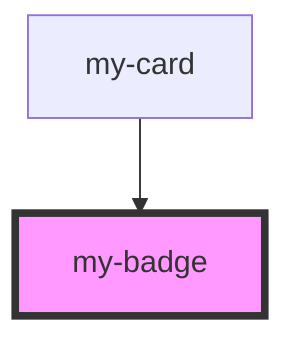

# my-badge

<!-- Auto Generated Below -->

## Properties

| Property  | Attribute | Description | Type                                            | Default     |
| --------- | --------- | ----------- | ----------------------------------------------- | ----------- |
| `variant` | `variant` |             | `"default" \| "explicit" \| "live" \| "master"` | `'default'` |

## Dependencies

### Used by

 - [my-card](../my-card)

### Graph

----------------------------------------------

*Built with [StencilJS](https://stenciljs.com/)*
