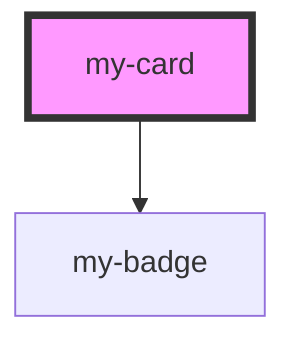

# my-card

<!-- Auto Generated Below -->

## Properties

| Property   | Attribute  | Description           | Type                                                     | Default     |
| ---------- | ---------- | --------------------- | -------------------------------------------------------- | ----------- |
| `img`      | `img`      | This is the image url | `string`                                                 | `undefined` |
| `meta`     | --         |                       | `{ master: boolean; explicit: boolean; label: string; }` | `undefined` |
| `subtitle` | `subtitle` |                       | `"JavaScript" \| "TypeScript" \| "Web Components"`       | `undefined` |
| `top`      | `top`      |                       | `string`                                                 | `undefined` |

## Dependencies

### Depends on

- [my-badge](../my-badge)

### Graph

----------------------------------------------

*Built with [StencilJS](https://stenciljs.com/)*
